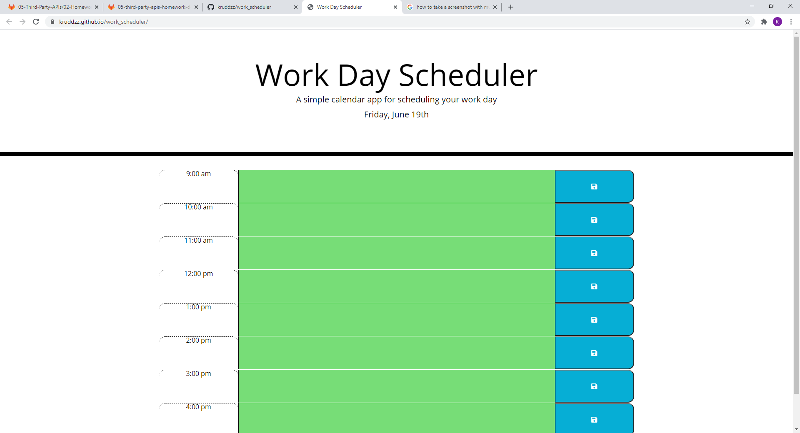

Work Scheduler
A simple calendar application that allows the user to save events for each hour of the day.

GIVEN I am using a daily planner to create a schedule
WHEN I open the planner
THEN the current day is displayed at the top of the calendar
WHEN I scroll down
THEN I am presented with timeblocks for standard business hours
WHEN I view the timeblocks for that day
THEN each timeblock is color coded to indicate whether it is in the past, present, or future
WHEN I click into a timeblock
THEN I can enter an event
WHEN I click the save button for that timeblock
THEN the text for that event is saved in local storage
WHEN I refresh the page
THEN the saved events persist

// USE CASES:
    // 1) When opened the planner presents:
        // a) Work Day Scheduler :A simple calendar app for scheduling your work day with current date listed below (at top of the page)
        // b) Time Blocks for daily operational hours 9 am to 5 pm 
        // c) lock data type button next to Time Blocks
    // 2) User may see time blocks in grey, red or green depending on time of day
        // a) grey is for time blocks that have passed.
        // b) red is for current time block
        // c) green is for future time blocks
    // 3)When user clicks on the time blocks
        // a) then the user should be able to enter an event
    // 4)When user clicks the lock button for that time block
        // a) The text for that time block is saved into local storage
    // 5)When the page is refreshed the data is still present

   Website: https://kruddzz.github.io/work_scheduler/
   GitHub Repository: https://github.com/kruddzz/work_scheduler

